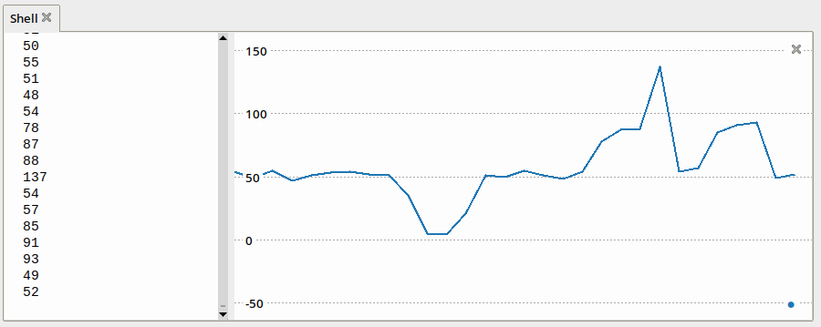

# ESP32 MicroPython Workshop


Mikrokontrolér _ESP32_ je cenovo dostupné a namakané zariadenie vhodné pre oblasť _IoT_ vybavené _WiFi_ a _Bluetooth LE_. Čo je však úplne fantastické, má dostatok pamäte na to, aby ste do neho nahrali firmvér s jazykom _MicroPython_. Na tomto workshope si spolu vytvoríme jednoduché _IoT_ riešenie, na ktorom ukážeme silu mikrokontroléra _ESP32_ a jednoduchosť jeho programovania vďaka jazyku _MicroPython_.

**Odporúčaný čas:** 180 minút

**Upozornenie:** Webinár nebude dostatočne dlhý na to, aby naše výsledné riešenie spĺňalo kritériá uvedené v knihe [Čistý kód](https://www.martinus.sk/?uItem=73286). Zameriame sa preto viac na WOW efekt celého výsledku. O detailoch/rozporoch/vylepšeniach sa môžeme porozprávať osobne mimo workshop-u ;)


## Ciele

1. Naučiť sa základy práce v REPL režime jazyka _MicroPython_.
1. Naučiť sa pracovať s vnútornými senzormi mikrokontroléra _ESP32_.
1. Naučiť sa pripojiť mikrokontrolér _ESP32_ do internetu pomocou zabudovaného _WiFi_ modulu.
1. Naučiť sa publikovať údaje z mikrokontroléra pomocou komunikačného protokolu _MQTT_.
1. Naučiť sa základy používania modulu `urequests` pre prácu s HTTP protokolom.


## Krok 1. Čo budeme potrebovať?

Ešte predtým, ako sa pustíme do tvorby aplikácie, si pripravíme prostredie pre prácu. Konkrétne budeme potrebovať:

- editor kódu [Thonny](https://thonny.org) (alebo ľubovoľný iný editor kódu jazyka Python)
- dosku s mikrokontrolérom _ESP32_, zapojenie podľa schémy a USB kábel na prepojenie dosky s počítačom
- magnet
- LED diódu
- voľný vodič typu M-F (na detekovanie dotyku)
- prekopírovať na mikrokontrolér súbory [`playground.py`](src/playground.py), [`helpers.py`](src/helpers.py) a vytvoriť prázdny súbor `workshop.py`, do ktorého budeme zapisovať kód výsledného riešenia
- kľúč pre prístup k HTTP REST API služby [openweathermap.org](https://openweathermap.org/) (pre workshop stačí jeden, takže stačí, ak sa zaregistruje len inštruktor a vyzdieľa svoj kľúč s ostatnými; registrácia je zdarma)
- nahratý alternatívny firmwér s podporou protokolu [ESP-NOW](https://www.espressif.com/en/products/software/esp-now/overview) z [tejto adresy](https://github.com/glenn20/micropython-espnow-images)

Ak používate OS Windows a chcete pracovať s mikrokontrolérom _ESP32_, musíte si nainštalovať ešte ovládač pre *CP210x USB to UART Bridge* napríklad [odtiaľto](https://www.silabs.com/products/development-tools/software/usb-to-uart-bridge-vcp-drivers?tab=downloads).


## Krok 2. Predstavenie mikrokontroléra ESP32


Samotný mikrokontrolér obsahuje tieto senzory:

* hallova sonda/senzor
* kapacitný dotykový senzor
* senzor vnútornej (pracovnej) teploty

A presne na prácu s týmito senzormi sa pozrieme počas tohto workshopu. Vytvoríme si jednoduchý scenár, pomocou ktorého budeme monitorovať teplotu v miestnosti a vstup do nej:

* Teplomer bude predstavovať aktuálnu teplotu v miestnosti. Tú budeme v (ne)pravidelných intervaloch posielať pomocou protokolu MQTT ďalšej službe.
* Hallovu sondu budeme používať ako snímač otvorených/zatvorených dverí. Na tento účel nám pomôže ešte externý magnet. Priložením magnetu k hallovej sonde budeme simulovať zatvorenie dverí. Oddialením magneta sa dvere otvoria. A okrem toho - keď budú dvere otvorené, rozsvieti sa LED dióda. Keď sa naopak dvere zatvoria, LED dióda zhasne.
* Po zistení dotyku na kapacitnom dotykovom senzore stiahneme aktuálne počasie v zvolenej lokalite. Aktuálnu teplotu vypíšeme do konzoly (na sériovú linku).

Schéma zapojenia pre tento scenár vyzerá takto:

**Upozornenie:** Vo svojich zapojeniach **NIKDY** nezapájajte LED diódy bez ochranného rezistora!!!


## Krok 2. Prvé kroky

Aby ste mohli používať editor Thonny na programovanie mikrokontrolérov _ESP32_, potrebujete si skontrolovať nastavenie interpretéra. To vykonáte v menu `Run > Interpreter`. Tu si zo zoznamu vyberte položku `MicroPython (ESP32)`. Ako posledné si nastavte port, na ktorom je vaše zariadenie pripojené. Tu môžete vybrať voľbu pre automatickú detekciu, ktorá tento problém vyrieši za vás.

Po pripojení zariadenia a správnej konfigurácii sa vám v okne _Shell_ zobrazí REPL režim jazyka _MicroPython_ na mikrokontroléri _ESP32_. Komunikácia ide cez sériovú linku.

Ak chcete vedieť, aké moduly máte k dispozícii, môžete si ich všetky nechať vypísať príkazom `help('modules')`:

```python
>>> help('modules')
__main__          inisetup          ucollections      urandom
_boot             math              ucryptolib        ure
_onewire          micropython       uctypes           urequests
_thread           neopixel          uerrno            uselect
_uasyncio         network           uhashlib          usocket
_webrepl          ntptime           uheapq            ussl
apa106            onewire           uio               ustruct
btree             uarray            ujson             usys
builtins          uasyncio/__init__ umachine          utime
cmath             uasyncio/core     umqtt/robust      utimeq
dht               uasyncio/event    umqtt/simple      uwebsocket
esp               uasyncio/funcs    uos               uzlib
esp32             uasyncio/lock     upip              webrepl
flashbdev         uasyncio/stream   upip_utarfile     webrepl_setup
framebuf          ubinascii         uplatform
gc                ubluetooth        upysh
Plus any modules on the filesystem
```

**Poznámka:** V zozname modulov si môžete všimnúť, že mnohé z nich majú v názve prefix s písmenom `u` (symbol pre _mikro_). Častokrát sa jedná o štandardný modul jazyka _Python_ upravený pre použitie v jazyku _MicroPython_. To napríklad znamená, že ak potrebujete pracovať s formátom _JSON_ a ste zvyknutí na prácu so štanradným modulom `json`, v jazyku _MicroPython_ máte k dispozícii jeho _"micro"_ verziu s názvom `ujson`. Interpreter jazyka _MicroPython_ tiež zvláda mnohé moduly importovať na základe ich názvov zo štandardnej knižnice. Takže miesto:

```python
import ujson
```

môžete modul importovať aj

```python
import json
```


## Krok 3. Blikanie LED diódou v režime REPL

LED diódu máme pripojenú ku pin-u s číslom _21_. Budeme ju používať na signalizáciu stavu dverí, čo znamená, že LED dióda bude svietiť vtedy, keď budú dvere otvorené a diódu zhasneme, keď sa dvere zatvoria. Pri predstavení práce s LED diódou si ukážeme silu, ktorú nám ponúka _REPL_ režim jazyka _MicroPython_.

Začneme tým, že z balíka `machine` importujeme triedu `Pin`:

```python
>>> from machine import Pin
```

Vytvoríme objekt triedy `Pin`, ktorý bude reprezentovať _LED_ diódu. Konštruktor triedy `Pin` má tieto parametre:

* `id` - povinný parameter, ktorý identifikuje pin
* `mode` - režim pin-u, ktorý môže byť
  * `Pin.IN` - pin pre vstup, a
  * `Pin.OUT` - pin pre výstup
* `pull` - špecifikuje, či má mať pin pripojený (slabý) pull rezistor a jeho hodnota môže byť
  * `Pin.PULL_UP` - zapnutý pull up rezistor
  * `Pin.PULL_DOWN` - zapnutý pull down rezistor
  * `None` - žiadny pull up alebo pull down rezistor


**Poznámka:** Trieda `Pin` má výrazne viac možností konfigurácie a práce. Pre podrobnejšie informácie sa pozrite do [dokumentácie](https://docs.micropython.org/en/latest/library/machine.Pin.html).

Výsledný kód pre vytvorenie výstupného pin-u na pin-e č. _21_ s pripojeným pull-down rezistorom bude vyzerať nasledovne:

```python
>>> led = Pin(21, Pin.OUT, Pin.PULL_DOWN)
```

Pre prácu s diódou, resp. všeobecne s digitálnym pin-om, máme k dispozícii niekoľko metód. Ak chceme získať aktuálny stav pin-u, zavoláme metódu `value()`:

```python
>>> led.value()
0
```

**Poznámka:** Pin sme pri jeho vytváraní nijako neinicializovali, takže hodnota na pin-e v skutočnosti nemusí byť `0`.

Pomocou metódy `value()` však môžeme aj hodnotu na pin zapísať. Ak chceme _LED_ diódu pripojenú na tento pin zasvietiť, do metódy `value()` zapíšeme ako parameter hodnotu `1`:

```python
>>> led.value(1)
```

Ak následne chceme _LED_ diódu zhasnúť, do metódy `value()` vložíme ako parameter hodnotu `0`:

```python
>>> led.value(0)
```

Trieda `Pin` však umožňuje nad svojimi inštanciami volať aj priamo metódu `on()` na zasvietenie (alternatíva pre `value(1)`) a metódu `off()` pre zhasnutie (alternatíva pre `value(0)`).

```python
>>> led.on()
>>> led.off()
```
Na záver už len spojíme všetko dokopy a vytvoríme jednoduchý blikač, ktorý bude blikať v sekundových intervaloch. Kód môžete zapísať do súboru `playground.py` a následne ho spustiť:

```python
from machine import Pin
from time import sleep


led = Pin(21, Pin.OUT)

while True:
    led.on()
    sleep(1)
    led.off()
    sleep(1)
```


## Krok 4. Hallova sonda/senzor

Mikrokontrolér _ESP32_ je vybavený _hallovým senzorom_, ktorý detekuje prítomnosť magnetického poľa. Jeho sila je vyjadrená hodnotou, ktorú tento senzor vráti - čím je pole väčšie/silnejšie, tým je aj hodnota senzora vyššia.

Silu magnetického senzoru v okolí mikrokontroléra _ESP32_ prečítame zavolaním funkcie `hall_sensor()`, ktorá sa nachádza v module `esp32`:

```python
>>> from esp32 import hall_sensor
>>> hall_sensor()
44
```

Platí, že ak v okolí Hallovho senzora nie je magnetické pole, bude vrátená hodnota nízka. Ak sa však v okolí bude magnetické pole nachádzať, senzor bude vracať vysoké hodnoty.

Správanie senzora si môžeme otestovať veľmi jednoducho - vytvoríme nekonečnú slučku a v pravidelných intervaloch budeme odčítavať hodnoty z _hallovho senzora_. Túto slučku môžeme uložiť do súboru `playground.py`, ktorý budeme použiť na experimenty a výsledok môžeme zobrazovať pomocou _plotter_-a.

```python
from esp32 import hall_sensor
from time import sleep

while True:
    print(hall_sensor())
    sleep(0.5)
```



V našom scenári budeme _hallov senzor_ používať ako senzor otvorených dverí. Pre tento účel máme v súbore `helpers.py` vytvorenú  funkciu `is_door_open()`, ktorá nám na základe veľkosti magnetického poľa vráti aktuálny stav dveri:

* vráti hodnotu `True`, ak sú dvere otvorené (v tomto prípade senzor vráti nízku hodnotu), alebo
* vráti hodnotu `False`, ak sú dvere zatvorené (v tomto prípade senzor vráti vysokú hodnotu).

Funkcia je veľmi jednoduchá a vyzerá takto:

```python
from esp32 import hall_sensor

HALL_TRESHOLD = 150

def is_door_open():
    return hall_sensor() < HALL_TRESHOLD
```

Vyskúšať ju môžete priamo v REPL režime takto:

```python
>>> from helpers import is_door_open
>>> is_door_open()
True
```

**Poznámka:** Hodnotu, pri ktorej budeme považovať dvere za zatvorené, si musí každý nastaviť sám, nakoľko citlivosť senzora a sila použitého magnetu môže byť na rozličných zariadeniach iná. Táto hodnota je uložená v premennej `HALL_TRESHOLD` v module `workshop.py`.


## Krok 5. Superloop

Je načase dať veci dokopy a vytvoriť senzor otvorených dverí využívajúci _hallov senzor_ a LED diódu. Aktualizujeme teda obsah súboru `workshop.py`.

```python
from machine import Pin
from time import sleep

from helpers import is_door_open


if __name__ == '__main__':
    # init door
    door_state = is_door_open()

    # init led
    led = Pin(21, Pin.OUT, Pin.PULL_DOWN)
    led.value(door_state)

    while True:
        # check state of the door
        if door_state != is_door_open():
            door_state = not door_state  # is_door_open()
            led.value(door_state)

            if door_state == True:
                print('>> Door has been opened.')
            else:
                print('>> Door has been closed.')

        sleep(0.5)
```


## Krok 6. Vnútorný senzor teploty

Mikrokontrolér _ESP32_ obsahuje aj vnútorný senzor teploty. Ten síce nemeria vonkajšiu teplotu okolia, ale pracovnú teplotu mikrokontroléra. Za istých okolností ho je však možné použiť aj ako senzor teploty prostredia. To je však možné len v tom prípade, ak okolitá teplota je vyššia ako pracovná teplota mikrokontroléra. A tá je v prípade mikrokontroléra _ESP32_ častokrát viac ako _40°C_.

Aktuálnu pracovnú teplotu mikrokontroléra vieme odmerať zavolaním funkcie `raw_temperature()`, ktorá sa nachádza v module `esp32`:

```python
>>> from esp32 import raw_temperature
>>> raw_temperature()
117
```

Hodnota, ktorú funkcia vráti je vo _Fahrenheitoch_. Ak ju chceme v stupňoch celzia, musíme ju skonvertovať podľa vzťahu:

```python
temp_c = (value - 32.0) / 1.8
```

Aj hodnoty teplomera môžeme vizualizovať pomocou plotter-a vypisovaním nameraných hodnôt v nekonečnej slučke. Nakoľko však pracovná teplota bude prevyšovať _40°C_, jej zmenu budeme dosahovať ťažšie. Mikrokontrolér napr. môžete skúsiť priložiť ku vetráku vášho laptopu.

Pre potreby nášho scenára sa v module `helpers.py` nachádza funkcia `get_temperature()`, ktorá nám vždy vráti hodnotu teploty už prevedenú na stupne celzia. Funkcia je veľmi jednoduchá a vyzerá takto:

```python
from esp32 import raw_temperature

def get_temperature():
    return (raw_temperature() - 32.0) / 1.8
```

Jej správanie si môžete overiť priamo v REPL režime napríklad takto:

```python
>>> from helpers import get_temperature
>>> get_temperature()
46.66667
```

## Krok 7. Supperloop Update I.

Našu hlavnú slučku môžeme aktualizovať vypísaním pracovnej teploty pri každej aktualizácii:

```python
while True:
    # ...
    print(f'{get_temperature()}°C')
	sleep(0.5)
```

## Krok 8. Kapacitný senzor dotyku

Mikrokontrolér _ESP32_ obsahuje _10_ kapacitných dotykových GPIO pinov. Konkrétne sa jedná o piny `0`, `2`, `4`, `12`, `13`, `14`, `15`, `27`, `32` a `33` (na obrázku s rozložením pin-ov sú označené ako `TOUCH0` až `TOUCH9`). Tieto piny dokážu detekovať zmeny vo všetkom, čo obsahuje elektrický náboj. Napríklad aj v ľudskej koži. To znamená, že tieto piny dokážu detekovať to, keď sa ich dotýkate napríklad prstom.

Ak chceme pracovať s kapacitným senzorom dotyku na týchto pin-och, musíme vytvoriť inštanciu triedy `TouchPad`, ktorá sa nachádza v module `machine`. Jej jediným parametrom je objekt typu `Pin`, ktorým identifikujeme konkrétny pin. Zmenu kapacity následne zistíme zavolaním metódy `.read()` nad vytvoreným objektom typu `TouchPad` .

```python
>>> from machine import Pin, TouchPad
>>> tp = TouchPad(Pin(14))
>>> tp.read()
647
```

V prípade, že bol detekovaný dotyk, hodnota, ktorú senzor vráti, bude nízka (rádovo jednotky až desiatky). V prípade, že dotyk detekovaný nebol, hodnota senzora bude vysoká (rádovo stovky). To si môžeme demonštrovať jednoduchou nekonečnou slučkou v súbore `playground.py`:

```python
from machine import Pin, TouchPad
from time import sleep

tp = TouchPad(Pin(14))
while True:
    print(tp.read())
    sleep(0.5)
```

Pre potrebu nášho scenára sa v module `helpers.py` nachádza funkcia `was_touch()`, ktorá vráti hodnotu `True`, ak bol detekovaný dotyk na zvolenom pin-e. V opačnom prípade vráti hodnotu `False`. Parametrom tejto funkcie je číslo pin-u, na ktorom chcete detekovať dotyk (v našom prípade je to pin č. `14`). Funkcia je veľmi jednoduchá a jej kód vyzerá takto:

```python
from machine import TouchPad, Pin

TOUCH_TRESHOLD = 50

def was_touch(pin):
    touchpad = TouchPad(Pin(pin))
    return touchpad.read() < TOUCH_TRESHOLD
```

Správanie funkcie si môžete overiť priamo v REPL režime napríklad takto:

```python
>>> from helpers import was_touch(pin)
>>> was_touch(14)
False
```

**Poznámka:** Podobne ako v prípade _hallovho senzora_, aj tu sa môžu hodnoty vrátené metódou `.read()` líšiť. Preto vašu hraničnú hodnotu si môžete nastaviť v premennej `TOUCH_TRESHOLD` v module `workshop.py`.


## Krok 9. Superloop Update II.

Po detekovaní dotyku v našej výslednej aplikácii dôjde k stiahnutiu dát o počasí z internetu. Keďže ale zatiaľ nie sme pripojení na internet, miesto počasia len vypíšeme na obrazovku, že sme detekovali dotyk. Neskôr túto časť nahradíme informáciami o počasí.

Po úpravách bude náš kód v súbore `workshop.py` vyzerať takto:

```python
from esp32 import hall_sensor
from machine import Pin
from time import sleep

from helpers import is_door_open, was_touch, get_temperature


if __name__ == '__main__':
    # init door
    door_state = is_door_open()

    # init led
    led = Pin(21, Pin.OUT, Pin.PULL_DOWN)
    led.value(door_state)

    # init touchpad
    touch_state = was_touch(14)

    while True:
        # check state of the door
        if door_state != is_door_open():
            door_state = not door_state  # is_door_open()
            led.value(door_state)

            if door_state == True:
                print('>> Door has been opened.')
            else:
                print('>> Door has been closed.')

        # check the state of touch pad
        if touch_state != was_touch(14):
            touch_state = not touch_state  # was_touch(tp)

            if touch_state is True:
                print('>> Touch detected.')

        # print temperature
        print(f'{get_temperature()}°C')

        sleep(0.5)
```


## Krok 8. Pripojenie do siete WiFi

Pre pripojenie k WiFi použijeme mierne modifikovanú verziu funkcie `do_connect()`, ktorá sa nachádza v module `helpers.py`. Túto funkciu odporúčajú použiť aj autori dokumentácie jazyka _MicroPython_ pre mikrokontrolér _ESP32_. Jej pôvodnú verziu môžete nájsť na [tejto adrese](http://docs.micropython.org/en/latest/esp32/quickref.html#networking). Zmeny sú len mierne:

* funkcia má parameter pre SSID a heslo do WiFi siete
* po úspešnom pripojení dôjde ku synchronizácii hodín pomocou protokolu NTP

```python
def do_connect(ssid, password):
    import network, ntptime, machine
    wlan = network.WLAN(network.STA_IF)
    wlan.active(True)
    if not wlan.isconnected():
        print('>> Connecting to network...')
        wlan.connect(ssid, password)
        while not wlan.isconnected():
            pass
    print('>> Network config:', wlan.ifconfig())

    # set time and date with NTP
    print('>> Synchronizing time...')
    ntptime.settime()
    rtc = machine.RTC()
    now = rtc.datetime()
    print(f'>> Current time: {now[0]}-{now[1]:02}-{now[2]:02}T{now[4]:02}:{now[5]:02}:{now[6]:02}Z')
```

Funkciu môžeme samozrejme otestovať priamo v REPL režime:

```python
>>> from helpers import do_connect
>>> do_connect('ssid', 'password')
```

Ak máme správny názov siete a rovnako tak máme prístupové heslo do siete, po úspešnom pripojení sa zobrazia tieto informácie:

* pridelená IP adresa, maska siete a brána
* aktuálny čas (UTC), ktorý sa získa z NTP servera

```python
>>> from helpers import do_connect
>>> do_connect('ssid', 'password')
>> Network config: ('10.20.30.144', '255.255.255.0', '10.20.30.1', '10.20.30.1')
>> Synchronizing time...
>> Current time: 2022-09-08T09:14:15Z
```

Funkciu budeme volať v module `workshop.py` ako prvú po spustení - ak nebudeme pripojení do internetu, náš scenár nebude fungovať.

```python
if __name__ == '__main__':
    do_connect('ssid', 'password')
    # ...
```

V tomto momente sme úspešne pripojení s našim mikrokontrolérom do WiFi siete a môžeme sa pozrieť na možnosti jeho sieťovej komunikácie.


## Krok 9. MicroPython a komunikačný protokol MQTT

Priamo vo firmvéri _MicroPython_-u, ktorý je nahratý v mikrokontroléri, sa nachádza podpora pre komunikačný protokol _MQTT_. Jedná sa o moduly `umqtt.simple` a `umqtt.robust`. Budeme používať modul `umqtt.robust` a pripájať sa budeme k verejnému MQTT brokeru na adrese `broker.hivemq.com` na štandardnom porte pre _MQTT_ protkol `1883`.

Začneme tým, že si vytvoríme objekt klienta. Pre jeho vytvorenie budeme potrebovať:

* jednoznačný identifikátor klienta; očakáva sa reťazec
* adresu MQTT brokera; v našom prípade použijeme adresu `broker.hivemq.com`
* komunikačný port; predvolená hodnota je štanradné číslo portu `1883`, takže ho nastavovať nemusíme

Pripojiť sa k broker-u môžeme priamo z REPL režimu mikrokontroléra volaním:

```python
>>> from umqtt.robust import MQTTClient
>>> client = MQTTClient('jedinecne-id-klienta', 'broker.hivemq.com')
>>> client.connect()
```

**Poznámka:** Pre potreby workshop-u stačí, ak ako identifikátor použije každý účastník svoje meno. Problém však môže nastať, ak si dvaja účastníci zvolia rovnaký identifikátor. Pri reálnych riešeniach je však potrebné zabezpečiť, aby ste nemuseli zadávať identifikátor ručne a aj napriek tomu aby bola zabezpečená jeho jedinečnosť. Za týmto účelom môžete použiť volanie `ubinascii.hexlify(machine.unique_id())`, ktoré prekonvertuje idnetifikátor zariadenia (získaný volaním `machine.unique_id()`) na reťazec.

Na otestovanie spojenia môžeme začať posielať správy z mikrokontroléra do dohodnutej témy, ktorou môže byť napríklad:

```
pycon/messages
```

Priamo z REPL režimu môžeme správu do uvedenej témy poslať takto:

```python
>>> client.publish('pycon/messages', 'pozdrav z mikrokontrolera esp32')
```

Aby sme si overili, že tieto správy do témy `pycon/messages` naozaj odchádzajú, môžeme sa prihlásiť na odber správ doručovaných do tejto témy. To môžeme zabezpečiť viacerými spôsobmi:

* pomocou [HiveMQ webového klienta](http://www.hivemq.com/demos/websocket-client/) rovno v prehliadači,
* pomocou niektorého desktopového klienta, alebo
* môžeme použiť nástroje z príkazového riadku v prostredí OS Linux z balíčka `mosquitto-clients`
    ```bash
    $ mosquitto_sub -h broker.hivemq.com -F '@Y-@m-@dT@H:@M:@S@z : %p' -t 'pycon/messages'
    ```


## Krok 10. Publikovanie teploty cez protokol MQTT

V našom scenári budeme pomocou protokolu _MQTT_ publikovať nameranú teplotu. Aktualizujeme teda náš program o pripojenie k MQTT brokerovi a o publikovanie údajov o teplote do kanála

```
pycon/sk/2022/meno_pouzivatela/door
```

MQTT klienta vytvoríme rovno po pripojení k sieti:

```python
if __name__ == '__main__':
    # connect to wifi
    do_connect('ssid', 'password')

    # connecting to mqtt broker
    client = MQTTClient('jedinecne-id-klienta', 'broker.hivemq.com')
    client.connect()

    # ...
```

Publikovať teplotu budeme na/za riadkom, kde ju vypisujeme pomocou funkcie `print()`. Dôležité je však uviesť, že publikovaná hodnota/správa musí byť typu reťazec (`str`). Preto je potrebné pred odoslaním dáta najprv na reťazec konvertovať:

```python
# ...

# publish temperature
print(f'{get_temperature()}°C')
client.publish('pycon/sk/2022/mirek/temp', str(get_temperature()))

sleep(0.5)
```

Správy môžeme sledovať ako pri testovaní - napríklad z príkazového riadku pomocou nástroja `mosquitto_sub`:

```bash
$ mosquitto_sub -h broker.hivemq.com -F '%t %p' -t 'pycon/sk/2022/mirek/temp'
```

Podobným spôsobom môžeme publikovať aj údaj o stave dverí. Do časti programu, kde ošetrujeme zmenu stavu dverí môžeme pripísať riadok:

```python
client.publish('pycon/sk/2022/mirek/door', str(int(door_state)))
```


## Krok 11. Stiahnutie informácií o počasí cez protokol HTTP

Podľa scenára máme v prípade detekovania dotyku stiahnuť z internetu o počasí pre zadanú lokáciu. Využijeme na to REST API služby [openweathermap.org](https://www.openweathermap.org), s ktorou budeme komunikovať pomocou komunikačného protokolu HTTP. Na tento účel použijeme modul `urequests`, ktorý je mikro verziou známeho a populárneho balíčka v Pythone s názvom [`requests`]().

Dopyt pre získanie aktuálneho počasia v _Bratislave_ v režime REPL bude vyzerať takto:

```python
>>> import urequests
>>> url = 'http://api.openweathermap.org/data/2.5/weather?units=metric&q=bratislava&appid=9e547051a2a00f2bf3e17a160063002d'
>>> response = urequests.get(url)
```

**Poznámka:** Kľúč pre prístup k REST API v požiadavke uvedený ako parameter `appid` je vytvorený len pre potreby tohto workshop-u. Po jeho skončení nebude fungovať. Pre získanie vlastného kľúča sa zdarma zaregistrujte na uvedenej službe.

Následne sa môžeme pozrieť na výsledok nášho dopytu. HTTP stavový kód zobrazíme zapísaním:

```python
>>> response.status_code
200
```

Dáta, ktoré sme získali pomocou dopytu, sa nachádzajú vo formáte JSON. Tie vieme skonvertovať na slovník zavolaním:

```python
>>> data = response.json()
```

Ich zobrazením uvidíme všetky údaje, ktoré sme získali zo služby:

```python
>>> print(data)
```

Pre zjednodušenie práce je v module `helpers.py` vytvorená funkcia `get_current_weather()`, ktorá pre zvolenú lokáciu vráti slovník len s názvom lokácie, kódom krajiny a aktuálnou teplotou. Funkcia vyzerá takto:

```python
import urequests

APPID = '9e547051a2a00f2bf3e17a160063002d'

def get_current_weather(location):
    url = f'http://api.openweathermap.org/data/2.5/weather?units=metric&q={location}&appid={APPID}'
    response = urequests.get(url)
    data = response.json()
    response.close()

    return {
        'location': data['name'],
        'country': data['sys']['country'],
        'temp': data['main']['temp']
    }
```

Funkcia sa dá vyskúšať jednoducho z REPL režimu takto:

```python
>>> from helpers import get_current_weather
>>> get_current_weather('kosice')
{'country': 'SK', 'temp': 17.25, 'location': 'Kosice'}
```


## Krok 12. Prezentovanie informácií o počasí po detekovaní dotyku

V module `workshop.py` nájdeme miesto, kde po detekcii dotyku vypisujeme do konzoly text. Za funkciu `print()` pridáme ďalšie riadky kódu:

```python
if touch_state is True:
    print('>> Touch detected.')
    data = get_current_weather('bratislava')
    print(f'>> Aktuálna teplota v meste {data["location"]} ({data["country"]}) je {data["temp"]}°C')
```


## Krok 13. ESP-NOW beacon

Maják (z angl. _beacon_) je (bezdrôtové) zariadenie, ktoré v pravidelných intervaloch vysiela rádiový signál s údajmi pre iné zariadenia. No a takýto maják s údajmi, ktoré máme, si vyrobíme z mikrokontroléra _ESP32_ a vysielať ho budeme pomocou komunikačného protokolu _ESP-NOW_.


### O protokole _ESP-NOW_


_ESP-NOW_ je bezdrôtový komunikačný protokol, ktorý podporuje:

* priame spojenie s max. 20 zaregistrovanými zariadeniami bez WiFi protokolu
* šifrovanú a otvorenú komunikáciu (naraz je možné šifrovane komunikovať s max. 6 klientmi)
* max. dĺžku správy _250_ bytov
* súčasnú komunikáciu aj s WiFi na mikrokontroléroch _ESP32_ a _ESP8266_

Tento protokol je vhodný na riešenia v malých _IoT_ sieťach, v riešeniach citlivých na oneskorenie alebo na nízku spotrebu, prípadne v riešeniach pre komunikáciu na veľké vzdialenosti medzi zariadeniami (až stovky metrov).

Tento protokol taktiež umožňuje sledovať silu WiFi signálu (RSSI) komunikujúcich zariadení.


### Inicializácia vysielania

Pre prácu s protokolom _ESP-NOW_ musíme mať zapnutý a aktivovaný _WiFi_ modul. To znamená, že potrebujeme v našom kóde spustiť aspoň tieto riadky:

```python
import network

wlan = network.WLAN(network.STA_IF)
wlan.active(True)
```

V našom prípade túto aktiváciu rieši funkcia `do_connect()`, takže nepotrebujeme náš kód nijako upravovať. Ak však budete riešiť aplikáciu, ktorá bude komunikovať len pomocou tohto protokolu, vaše riešenie musí tieto riadky obsahovať.

Okrem toho však treba vytvoriť objekt z triedy `ESPNow`. To urobíme pomocou nasledujúcich riadkov:

```python
from espnow import ESPNow

espnow = ESPNow()
espnow.active(True)
```


### Manažment peer-ov

Predtým, ako budeme môcť poslať správu inému zariadeniu (z angl. _peer_), musíme toto zariadenie zaregistrovať. Zaregistrovať zariadenie je možné zavolaním metódy `.add_peer()` nad objektom typu `ESPNow` s MAC adresou zariadenia, ktorému chceme posielať správu.

MAC adresu je možné zistiť na cieľovom zariadení nasledovne:

```python
>>> import network
>>> wlan = network.WLAN(network.STA_IF)
>>> wlan.config('mac')
b'\xb4\xe6-\x9e7M'
```

Zistené zariadenie nasledovne vieme zaregistrovať takto:

```
espnow.add_peer(b'\xb4\xe6-\x9e7M')
```

Overiť registráciu môžeme napríklad vypísaním zoznamu všetkých zaregistrovaných zariadení volaním:

```
>>> espnow.get_peers()
((b'\xb4\xe6-\x9e7M', b'\x00\x00\x00\x00\x00\x00\x00\x00\x00\x00\x00\x00\x00\x00\x00\x00', 0, 0, False),)
```


### Príprava správy

Správa, ktorú budú naše majáky vysielať, musí mať max. _250_ znakov. Preto ju budeme vysielať ako jednoduchý reťazec v _CSV_ formáte. Správa bude v tvare:

```
meno majáka;teplota;úroveň mag. poľa
```

Správu si pripravíme do premennej `payload` takto:

```python
payload = '{};{};{}'.format(
    'makac',
    get_temperature(),
    hall_sensor())
```


### Odoslanie správy

Pripravenú správu odošleme zavolaním metódy `.send()` nad objektom typu `ESPNow`. Táto metóda má dva parametre:

* MAC adresa zariadenia, ktorému správu posielame, a
* samotnú správu

Odoslanie pripravenej správy bude teda vyzerať nasledovne:

```python

```


## Ďalšie zdroje

* Namakaný deň: [ESP32 labs](https://github.com/namakanyden/esp32-labs) - ďalšie laby pre mikrokontrolér _ESP32_, ktoré predstavujú pripojenie a prácu s niektorými senzormi a akčnými členmi
* [MicroPython](https://micropython.org/) - Domovská stránka projektu _MicroPython_.
* [Quick reference for the ESP32](http://docs.micropython.org/en/latest/esp32/quickref.html) - Skrátená dokumentácia jazyka _MicroPython_ pre dosku s mikrokontrolérom _ESP32_.
* [Random Nerd Tutorials](https://randomnerdtutorials.com/) - Portál venovaný nie len programovaniu mikrokontroléra _ESP32_ v jazyku _MicroPython_.
* [ESP32 Labs](https://github.com/namakanyden/esp32-labs) - Niekoľko labov pre začiatočníkov v jazyku _MicroPython_ s mikrokontrolérom _ESP32_.
* Last Minute Engineers: [ESP32 Projects](https://lastminuteengineers.com/electronics/esp32-projects/) - Časť portálu [Last Minute Engineers](https://lastminuteengineers.com) venovaná konkrétne projektom a informáciám o mikrokontroléri _ESP32_.
* [HiveMQ Web Client](http://www.hivemq.com/demos/websocket-client/) - MQTT klient vo webovom prehliadači
* [Support for the ESP-NOW protocol](https://micropython-glenn20.readthedocs.io/en/latest/library/espnow.html) - dokumentácia pre komunikačný protokol *ESP-NOW* v jazyku *MicroPython*


## Licencia

Uvedené dielo podlieha licencii [Creative Commons BY-NC-SA 4.0](https://creativecommons.org/licenses/by-nc-sa/4.0/deed.cs).

   

